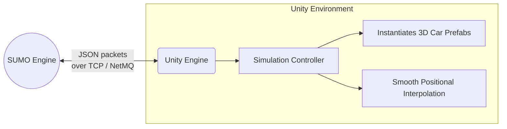

# 🚗 SUMO2Unity: Traffic Co-Simulation Tool

**Bridging microscopic traffic simulation with high-fidelity Virtual Reality rendering.**

## 📖 Introduction
Traditionally, traffic safety researchers invest considerable effort and money heavily customizing unique systems to bridge traffic models with realistic visuals—effectively 're-inventing the wheel' for every new study. 

**SUMO2Unity** is an open-source co-simulation tool created by the **SimuTraffX-Lab** that unifies the mathematical traffic logic of **SUMO (Simulation of Urban MObility)** with the 3D rendering power of the **Unity Game Engine**. 

### 🎯 Key Capabilities
1. **Automated 3D Generation:** Import extremely complex 2D SUMO road networks (`net.xml`, `poly.xml`) and watch them procedurally generate into 3D Unity meshes, road decals, and terrain intersections in seconds.
2. **Real-time Sync Protocol:** A lightweight TCP/NetMQ background thread synchronizes trajectory coordinates (X, Y, Z) and traffic light phases identically across both programs every `0.10s`.
3. **Data Logging:** Built-in performance logic precisely logs experimental outcomes into CSV-friendly formats.
4. **Standalone Simplicity:** Runs without requiring heavy external C++ wrappers. Only SUMO and Unity (both free) are needed.

## 📺 Demos & Use Cases
Sumo2Unity supports **VR and Human-in-the-Loop Simulation**, from driving an ego car to bicycling through dense traffic logically managed by SUMO AI.

*Click the thumbnails to play the YouTube Demos:*

| 🚗 Driver Perspective | 🚲 Bicycle Perspective |
|:---:|:---:|
|  |  |

| 🌆 3D Visualization (Bird's Eye) | 🏙️ Complex Urban Render |
|:---:|:---:|
|  |  |

## ⚙️ Architecture Overview

The system architecture utilizes **JSON messages over NetMQ** (ZeroMQ) to decouple the heavy physics traffic logic from the visual rendering threads, keeping Unity's framerate buttery-smooth while communicating over `localhost` ports `5556` and `5557`.

## 🚀 Getting Started

Follow these step-by-step video tutorials to configure the environment:

### Phase 1: SUMO Requirements
▶️ **[Watch SUMO setup tutorial](https://youtu.be/IwsrNWlX9Ag?si=ui75deOeqbreQTf7)**
1. Install [SUMO (Version 1.22)](https://eclipse.dev/sumo/).
2. Set Up SUMO Environment Variables in your OS.
3. Install Notepad++ for editing XML configurations.

### Phase 2: Unity Environment
▶️ **[Watch Unity VR setup tutorial](https://youtu.be/ngccSGH3-_8?si=X1Lx07NUWUqOvJ2f)**
1. Install Unity Hub.
2. Install **Unity Editor Version 6000.0.53f1**.
3. Install Visual Studio (along with Unity Game Development workloads).

### Phase 3: Launching Sumo2Unity
▶️ **[Watch Sumo2Unity Quickstart tutorial](https://youtu.be/Cv1wBGuaT0E)**
1. `Clone` or `Download` this repository as a `.zip` file.
2. Add the extracted folder to Unity Hub and open it using version `6000.0.53f1`.
3. Open a sample scenario, compile, and hit Play!

## 📝 Notes & Limitations
- **Road Maps:** Sumo2Unity constructs everything internally. There is no need for external mesh software (e.g., Blender) to map basic intersections.
- **Pedestrians:** SUMO pedestrians are not currently mapped via 3D models in this version of the pipeline.

## 📫 Support & Issues
If you encounter bugs, need help, or want to contribute to the pipeline, please open an issue in the **[Issues Section](https://github.com/SUMO2Unity/SUMO2Unity/issues)**.

Feel free to connect directly:

## 📜 Citations
If you utilize SUMO2Unity in academic research, please cite our papers to support the project:

> *Mohammadi, A., Park, P. Y., Nourinejad, M., Cherakkatil, M. S. B., & Park, H. S. (2024, June). SUMO2Unity: An Open-Source Traffic Co-Simulation Tool to Improve Road Safety. In 2024 IEEE Intelligent Vehicles Symposium (IV) (pp. 2523-2528). IEEE.*

> *Mohammadi, A., Cherakkatil, M. S. B., Park, P. Y., Nourinejad, M., & Asgary, A. (2025). An Open-Source Virtual Reality Traffic Co-Simulation for Enhanced Traffic Safety Assessment. Applied Sciences, 15(17), 9351.*

## ⚖️ License
* **Codebase:** Distributed under the MIT License.
* **Assets:** Distributed under the CC-BY License.
