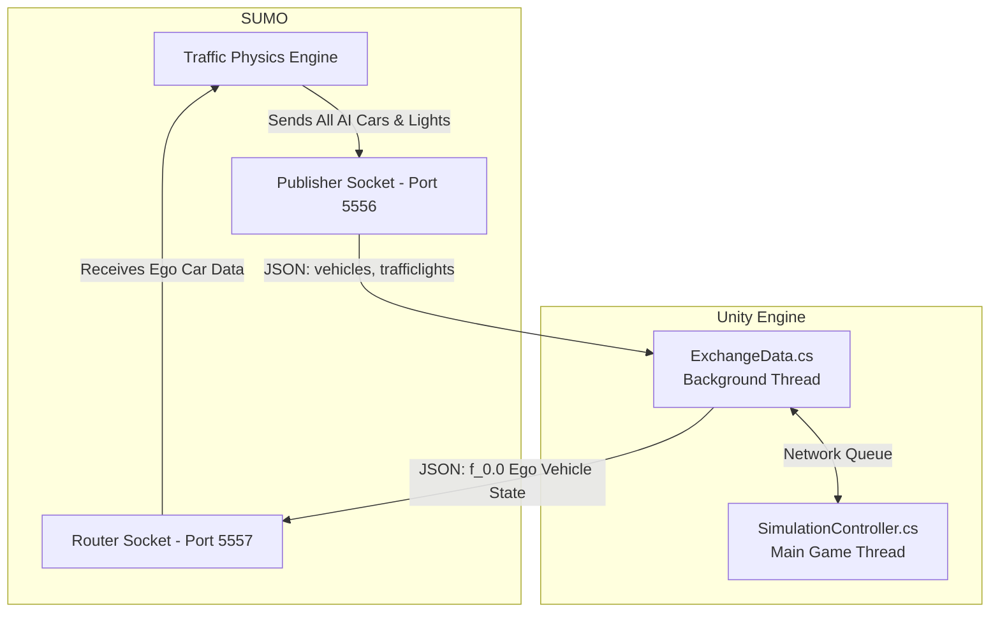

# The Definitive SUMO2Unity Technical Guide

This document is an exhaustive, heavily commented analysis of the **SUMO2Unity** co-simulation architecture. It is designed so that anyone—from a junior game developer to a traffic logic researcher—can understand exactly how the codebase works, how the logic flows, and how the two vastly different platforms communicate.

---

## 1. Glossary: Core Concepts Explained

Before diving into the codebase, it is crucial to understand the terminology used in the project:
*   **SUMO (Simulation of Urban MObility):** An open-source highly mathematical traffic simulator. Cars in SUMO are just X/Y coordinate numbers on a grid moving according to physics formulas (like the Krauss car-following model). There are no real graphics.
*   **Unity:** A 3D game engine. It excels at rendering lighting, shadows, physics interactions, and Virtual Reality views, but it isn't built to calculate fluid dynamics for traffic across a 10km city grid.
*   **Co-Simulation:** Running two separate simulators at the exact same time and tethering them together so they share a single reality.
*   **Ego Vehicle:** In autonomous driving research, the "Ego" vehicle is the main car being tested (or driven by a human player). All other cars are "Target" or "AI" vehicles.
*   **NetMQ / ZeroMQ:** A high-level, extremely fast networking library used to send data strings between programs. It is faster and more reliable than raw TCP sockets for this kind of work.

---

## 2. High-Level Architecture

SUMO and Unity run as completely separate background programs. They talk to each other almost like two people texting back and forth rapidly (10 times a second).



---

## 3. World Generation: How the Unity 3D Environment is Built

Before a simulation can happen, Unity needs a 3D world to render. SUMO maps are traditionally 2D vector files (like SVG or CAD files), specifically the `net.xml` and `poly.xml` files.

The **`RoadNetworkBuilder.cs`** script is a Unity Editor utility designed to convert these 2D vector maps into massive 3D environments instantly. Here is the step-by-step logic it follows:

### Step 1: Parsing the Map Data
The script relies on an auto-generated file called `NetFile.cs`, which converts the massive SUMO XML schema into standard C# objects. It scans the XML for `Edges` (roads), `Lanes` (sub-sections of roads), and `Junctions` (intersections).

### Step 2: Creating 3D Mesh Ribbons (The Roads)
Roads in SUMO are defined by a list of 2D points (e.g., Point A to Point B to Point C). 
*   Unity needs 3D triangles to draw an object. 
*   The code steps through every 2D point, calculates a perpendicular width (left and right), and extrudes a flat 3D ribbon to act as the asphalt.
*   It automatically applies UV Maps (texture coordinates) so that the asphalt texture repeats seamlessly across long highways.

### Step 3: Triangulating Intersections (The Junctions)
Intersections are shaped like irregular polygons (like a warped stop-sign shape). 
*   To render this, the script uses a complex math algorithm called **Triangulation** to split the irregular polygon footprint into dozens of tiny triangles. 

### Step 4: Intelligent Lane Markings
Drawing dashed lines on roads is famously tricky in 3D. If you just paint them along the road ribbon, they will incorrectly overlap the moment a road enters a 4-way intersection.
*   **The Clipping Algorithm:** The `RoadNetworkBuilder` uses a clever workaround. It stores the mathematical boundary of every junction. When it places a white dashed line "decal", it checks: *"Is this coordinate inside a junction polygon?"* If yes, it skips placing the decal. This keeps the centers of intersections clean, mimicking real-world painted limits.

---

## 5. Live Simulation: The Data Exchange

Once the world is built and you press Play, the runtime logic kicks in. The main actor here is **`SimulationController.cs`**, hooked up to **`ExchangeData.cs`**.

### 5.1 The Network Thread (NetMQ)
Unity's rendering framerate cannot afford to wait on network packets—if it did, the game would stutter wildly. Therefore, `ExchangeData.cs` spins up a totally separate background CPU thread. 
This thread sits in a highly optimized `while(true)` loop. It constantly receives JSON from SUMO, and places it into a `ConcurrentQueue` (a thread-safe waiting room) for the main Unity thread to process when it's ready.

### 5.2 The JSON Protocol
The pipeline passes standard text formats over the sockets. When SUMO updates, it sends a payload looking like this:
```json
{
  "type": "vehicles",
  "vehicles": [
    {
      "vehicle_id": "bus_12",
      "position": [ 120.4, 0.0, 55.1 ],
      "angle": 94.5,
      "type": "passenger_bus"
    }
  ]
}
```

### 5.3 Coordinate System Translation
This is one of the hardest parts of game-engine integration.
*   **SUMO:** Treats the world like a flat piece of paper. (X is left/right, Y is up/down on the paper).
*   **Unity:** Treats the world like a 3D box. (X is left/right, **Z is forward/back**, and Y is up into the sky).

When `SimulationController.cs` reads the `position` array from SUMO, it explicitly maps them to accommodate the 3D space:
`Vector3 newPosition = new Vector3( position[0], position[2], position[1] );`
It essentially lays SUMO's flat coordinates onto Unity's floor (XZ plane) and uses SUMO's height for Unity's Y axis.

### 5.4 Object Pooling & Smoothing
The main loop checks the incoming IDs against its active map.
*   **Spawning:** If "bus_12" has never been seen, Unity searches the `CarModel` list, pulls the prefab for a bus, instantiates it, and assigns it an ID.
*   **Interpolation:** The problem with 0.10s ticks (10 frames per second) is that a car looks like it's teleporting/stuttering visually. The `VehicleController.cs` script applies a smooth lerp (Linear Interpolation) to visually slide the car gracefully to its new coordinate, so it looks like it's running at 60 Frames Per Second to the human eye.

---

## 6. Traffic Lights Synchronization

Just like vehicles, traffic lights are pushed via JSON from SUMO. The JSON defines an intersection ID, and a string of characters representing bulb states: 
`"GGggrr" (Green, Green, green yield, green yield, red, red)`

The `SimulationController.cs` digs into the specific junction's GameObject hierarchy. For every "Head" (the physical traffic light post), it locates the individual Green, Yellow, and Red mesh objects, and physically enables/disables the colored bulb renderer based on the corresponding character in the string.

---

## 7. Recording System & The Future

A built-in data logging system taps into Unity's physics engine (`FixedUpdate`). Setting `startRecordingFromZero = true` tells the engine to open a local streaming pipeline. 
Because it uses a highly efficient `StreamWriter`, it dumps exactly formatted CSV lines showing `timestep; vehicle_id; x; y; z` direct to the disk (`vehicle_data_report.txt`) without choking RAM. This guarantees precision for rigorous academic studies validating safety metrics.

### Conclusion
By relying on disconnected micro-services (via NetMQ TCP) instead of deeply coupled C++ libraries, SUMO2Unity created an extremely crash-resilient framework. You get the world-class microscopic traffic logic from the German Aerospace Center (SUMO), combined seamlessly with the industry-standard visual rendering capabilities of Unity.
